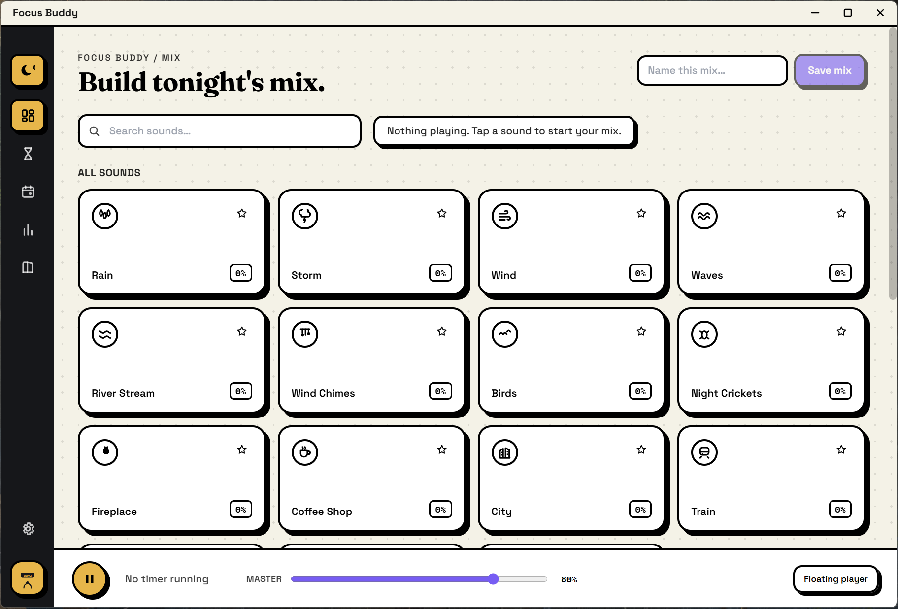
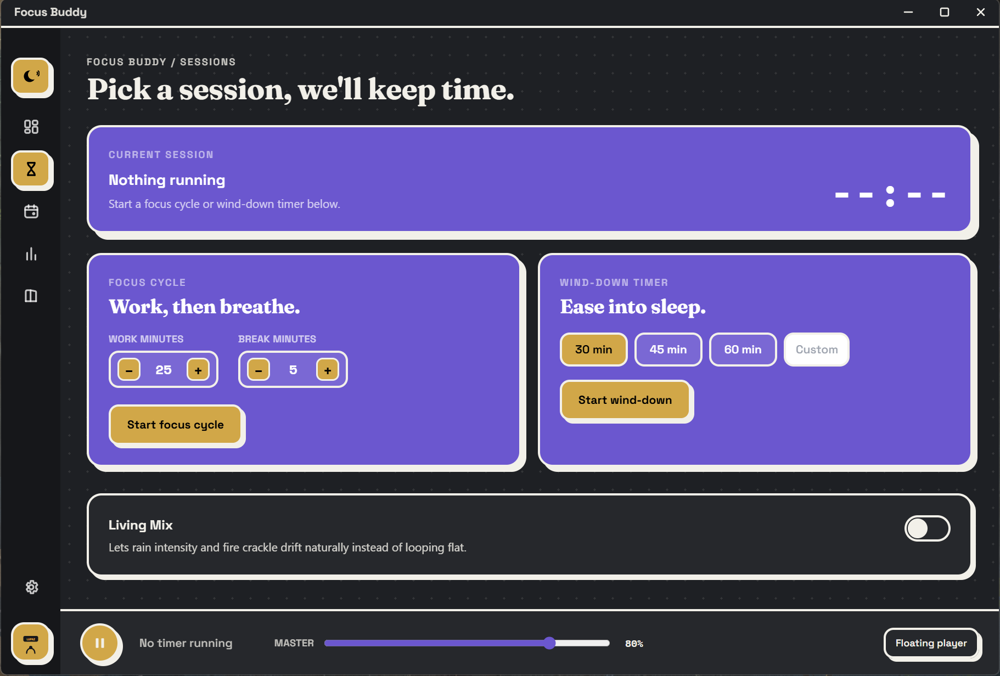
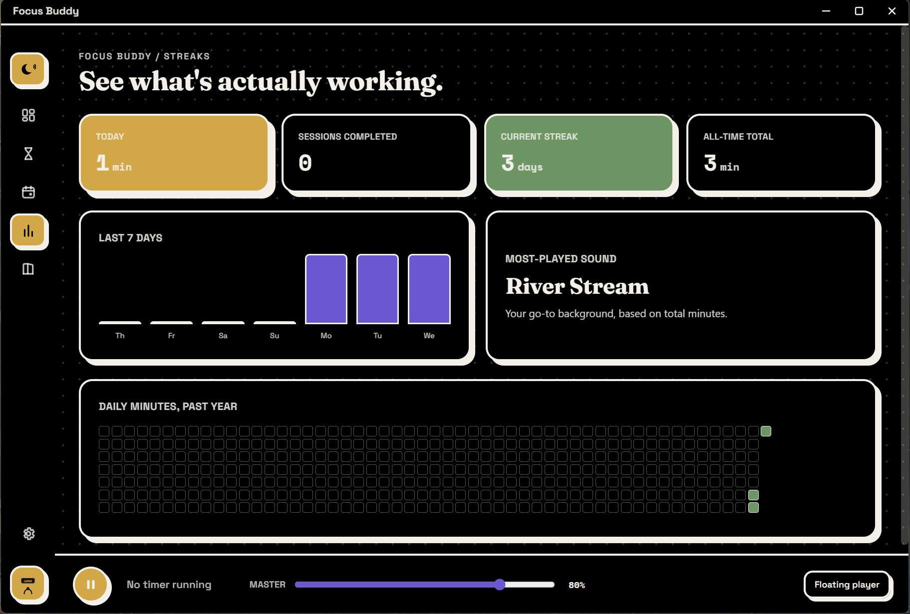

# Focus Buddy

**One app, every focus.**

Focus Buddy is a free, open source, fully offline ambient soundscape and focus companion. Layer rain, fire, city hum, and other sounds into your own mix, run focus cycles and wind down timers over the top, schedule recurring rituals that start a mix automatically, and track what's actually helping in a lightweight stats screen. No account, no telemetry, nothing that only works online.

It's one codebase that ships natively on Windows, macOS, and Linux, not a single platform Store app.

Crafted by Lupaz.


---

## Screenshots


*Mix tab - light mode*


*Sessions tab - dark mode*


*Streaks tab - OLED mode*


Focus Buddy has more screens than these three, Rituals, The Den, and Settings included, these are just a quick look.

---

## Features

- **Mix**: a bento grid of 15 ambient sounds (rain, storm, wind, waves, river stream, wind chimes, birds, night crickets, fireplace, coffee shop, city, train, boat, white noise, and keyboard typing). Adjust a sound's level by scrolling over its tile or dragging vertically on it, no separate slider track. Star sounds into a Favorites shelf, save your own named presets, or start from a curated Starter Blend (Rainy Cafe, Night Watch, Deep Focus, Fireside, Open Water) and customize it.
- **Sessions**: a Focus Cycle (work/break timer) and a Wind-down Timer, plus Living Mix, which lets rain, wind, and fire drift in intensity over time instead of looping flat, with a subtle/moderate/lively control.
- **Rituals**: schedule a saved mix to start automatically on chosen days and times, for a set duration.
- **Streaks**: today's minutes, a 7 day trend, session count, current streak, most played sound, all time total, and a GitHub style yearly heatmap.
- **The Den**: the full built in sound library (searchable) plus a Custom Sounds importer (drag and drop or file picker) supporting MP3, WAV, M4A, FLAC, and AAC.
- **Settings**: light/dark/OLED/system theme, tile density, output device selection, fade duration, launch and startup behavior, Deep Focus mode (suppresses OS notifications and pins a floating mini player during a focus cycle), update checks, backup and restore as one JSON file, and a user remappable global shortcut.
- A separate always on top floating mini player, draggable, for glancing at your timer under a full screen game or another app.
- Hooks into hardware media keys and the OS media overlay (Windows SMTC, macOS Now Playing, Linux MPRIS).
- A gapless Web Audio engine: every sound decodes once into an AudioBuffer and loops via AudioBufferSourceNode, so there's no click at the loop seam, and every fade (timers, Living Mix drift, mix blends) uses real GainNode ramps. The audio context suspends when nothing is playing, so idle CPU stays near zero.
- Zero telemetry, no accounts, fully usable offline. Everything is stored locally via electron-store.

---

## Design system

Focus Buddy uses a playful neo-brutalist bento look: thick black borders, hard offset shadows with no blur, a warm paper colored canvas next to a dark sidebar, and three flat accent colors (gold for warm and indoor sounds and primary actions, leaf for nature and outdoor sounds, violet for sessions and timers). Headlines are set in Fraunces, structural UI in Space Grotesk, countdowns and stats in Space Mono. Design tokens live in `tailwind.config.cjs` and `src/renderer/index.css`. See `CONTRIBUTING.md` for how to stay on brand when contributing.

---

## Building from source

Focus Buddy is an Electron + Vite + React + TypeScript app, built with electron-builder.

### Prerequisites

- Node.js 18 or newer
- npm 9 or newer
- Platform build tooling:
  - **Windows**: no extra tooling required for the default targets.
  - **macOS**: Xcode Command Line Tools (`xcode-select --install`).
  - **Linux**: standard build essentials (`build-essential` on Debian/Ubuntu, or your distro's equivalent) for native module compilation, plus `rpm` and `fakeroot` if you want to build the `.rpm`/`.deb` targets locally.

### Setup

```bash
git clone https://github.com/lupazcore/Focus-Buddy.git
cd focus-buddy
npm install
npm run icons   # rasterizes assets/icons/*.svg into .ico / .icns / PNGs
```

The built in sounds are already bundled in `assets/sounds`, there's nothing else to add before running.

### Run in development

```bash
npm run dev
```

This starts the Vite dev server, the TypeScript watcher for the main and preload processes, and Electron itself, wired together with `concurrently` and `wait-on`.

### Build for production

```bash
npm run build              # compiles renderer + main/preload, no packaging
npm run build:win-x64      # Windows 64-bit NSIS installer
npm run build:win-ia32     # Windows 32-bit NSIS installer (see the Electron pin note below)
npm run build:mac          # macOS universal (x64 + arm64) .dmg
npm run build:linux        # Linux AppImage + .deb + .rpm
npm run build:all          # all of the above, sequentially
```

Artifacts land in `release/`.

### Electron 43.x pin

`package.json` pins Electron to 43.0.0 on purpose. Electron 44 dropped prebuilt binaries for Windows ia32 and Linux armv7l. Focus Buddy still ships a 32-bit Windows installer via `build:win-ia32`, so it stays on the last Electron line that still publishes those binaries, 43.x, supported until roughly January 2027. When that line reaches end of life, ia32 support will need to be dropped or rebuilt around whatever replaces prebuilt binaries for that target at the time.

### Windows notes

- `build:win-x64` and `build:win-ia32` are separate scripts on purpose: electron-builder can't cleanly bundle both architectures into one NSIS installer, so Focus Buddy produces two separate installers instead of one universal Windows build.
- A portable, no install build is also available: `electron-builder --win portable --x64` (uses the same `portable` config in `electron-builder.yml`), if you'd rather hand someone a single `.exe` with no installer step.

### macOS notes

Without a paid Apple Developer ID, the built `.dmg` is unsigned and unnotarized. macOS Gatekeeper will refuse to open it with a normal double click. Right-click (or Control-click) the app in Applications, choose Open, and confirm in the dialog that appears. You only need to do this once per machine.

### Linux notes

- The AppImage works on essentially any modern distro, including Arch based ones, with no install step, just `chmod +x` it and run it.
- The tray icon and window chrome work under both X11 and Wayland.
- electron-builder doesn't produce AUR packages directly. If you're an Arch or EndeavourOS user and want a native package, a community submitted PKGBUILD would be a welcome contribution, see `CONTRIBUTING.md`.

### Auto updates

Focus Buddy uses electron-updater wired to GitHub Releases for the Windows and macOS builds. The Linux AppImage manages its own update flow independently, and Snap or Flatpak builds, if produced, update through their respective stores instead.

### GitHub Actions release builds

`.github/workflows/release.yml` builds Windows, macOS, and Linux artifacts in a matrix on every version tag push (`v*`) and uploads them to a draft GitHub Release.

---

## License

Focus Buddy's source code is MIT licensed, see `LICENSE`. Bundled audio is sourced from royalty-free libraries (Pixabay, Mixkit) that permit free commercial use, see `assets/sounds/LICENSES.md`.
